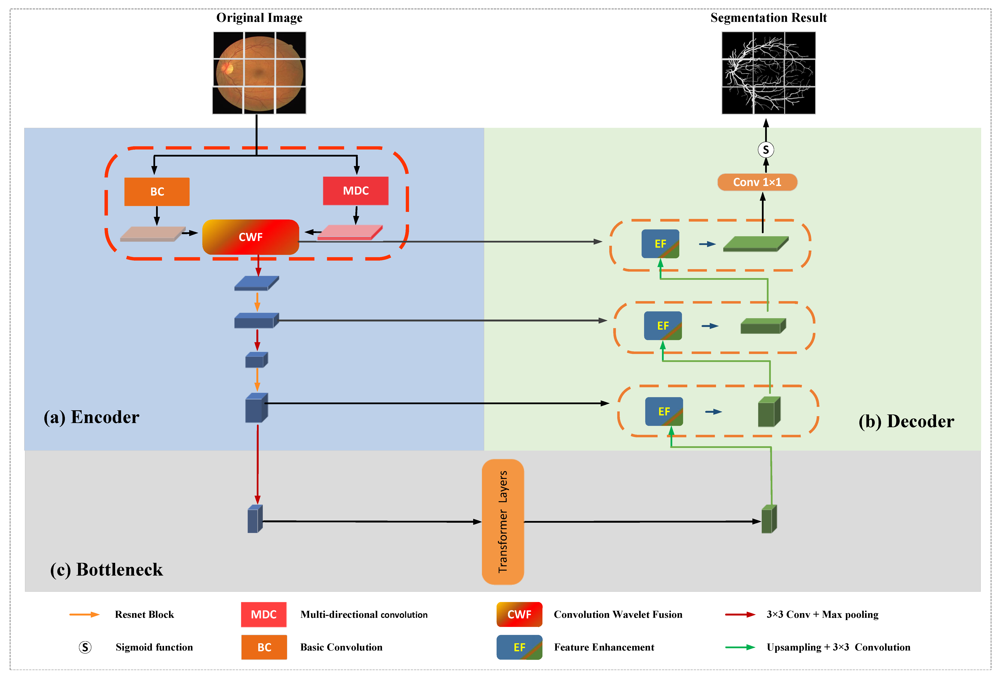

## Multi-Direction Convolution and Transformer Network for Retinal Vessel Segmentation

by Zhan Li, Jianjun Zeng, Yuning Wang, Yisong Han, Chengpeng Nie, Songdi Wu, Qinru Sun


* We provide related codes and configuration files to reproduce the "Multi-Direction Convolution and Transformer Network for Retinal Vessel Segmentation"

## Introduction
Our paper propose a Multi-Direction Convolution and Transformer Network for Retinal Vessel Segmentation (MCNet) by integrating multi-direction convolution and transformer together. The
MCNet employs a dual-branch encoder ,and a Transformer as the bottleneck, to capture the
multi-directional features and the global features, respectively.
In addition, we design two modules, the Convolution and
Wavelet Fusion module (CWF) and the Feature Enhancement
module (FE), to better fuse the features of the two encoders
and enhance the decoder’s feature expression ability.

<div align="center">
  
</div>


## Citation
```
@article{li2024MCNet,
  title={Multi-Direction Convolution and Transformer Network for Retinal Vessel Segmentation},
  author={Zhan Li, Jianjun Zeng, Yuning Wang, Yisong Han, Chengpeng Nie, Songdi Wu, Qinru Sun},
  journal={},
  pages={},
  year={},
  publisher={IEEE}
}
```

## Data Preprocessing
```
python data_process.py -dp DATASET_PATH -dn DATASET_NAME
```

## Train
Enter python train.py to run the code. If you are prompted for no packages, enter pip install * * to install dependent packages
```
python train.py -dp DATASET_PATH
```

## Test
After training, you can use the python test.py to validate your model.
```
python test.py -dp DATASET_PATH -wp WEIGHT_FILE_PATH
```
